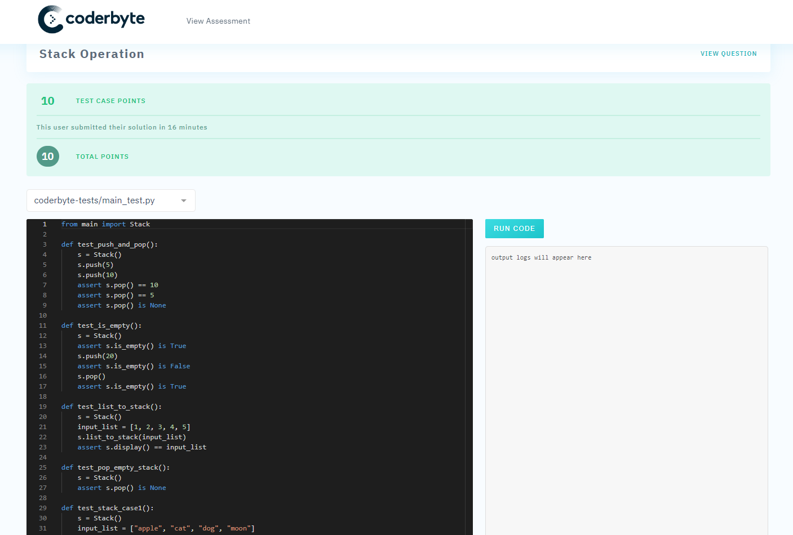

# Week19 Assignment

## Python code test

1. First duplicate:  
   
      

2. Max Depth of Binary tree:  
   
   

3. LinkedList Delete:  
   
   

4. Stack operation:  
   
   

5. Queue operation:  
   
   

## Submition  

